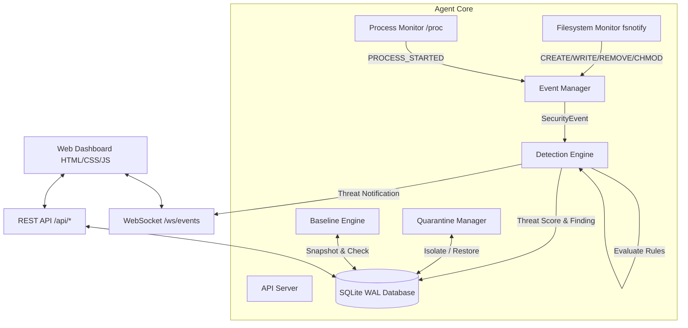

# LinuxGuard Architecture Documentation

LinuxGuard is a lightweight host-based security monitoring tool for Ubuntu/Linux servers.

## System Overview



## Data Flow

```text
Linux Kernel / OS
 │
 ├── File Change (fsnotify) ──┐
 │                            │
 └── Process Snapshot (/proc) ┴──> Event Manager (PubSub)
                                        │
                                        ▼
                                 Detection Engine
                                        │
                        ┌───────────────┴───────────────┐
                        ▼                               ▼
                 SQLite Database                 Threat Event
                        │                               │
                ┌───────┴───────┐               ┌───────┴───────┐
                ▼               ▼               ▼               ▼
            REST API       Baseline Check   Dashboard (WS)  Quarantine Vault
```

## Component Responsibilities

| Component | Package | Primary Responsibility |
|---|---|---|
| **Agent Orchestrator** | `internal/agent` | Initializes and gracefully stops all background monitors, SQLite connection, and HTTP server. |
| **Config Loader** | `internal/config` | Reads YAML configuration with default fallbacks for local dev or production deployment. |
| **Database** | `internal/database` | Manages SQLite WAL connection, migrations, and queries for events, baseline, and quarantine. |
| **Event Manager** | `internal/events` | Implements thread-safe pub/sub event dispatching across monitoring components and WebSockets. |
| **Filesystem Monitor** | `internal/filesystem` | Uses `fsnotify` for event-driven file change monitoring, recursive directory listening, and SHA-256 streaming hashing. |
| **Process Monitor** | `internal/processes` | Periodically polls active processes via `/proc` or `gopsutil`, diffing PIDs to detect `PROCESS_STARTED` events. |
| **Detection Engine** | `internal/detection` | Evaluates modular security rules, calculates threat scores (0-100), and classifies severities (`LOW`, `MEDIUM`, `HIGH`, `CRITICAL`). |
| **Quarantine Manager** | `internal/quarantine` | Performs path traversal and symlink checks, computes SHA-256, isolates suspicious files with `0400` permissions, and handles verified restores. |
| **API & Web Server** | `internal/api` | Serves REST endpoints, WebSockets (`/ws/events`), and embedded static HTML/CSS/JS dashboard (`go:embed`). |
