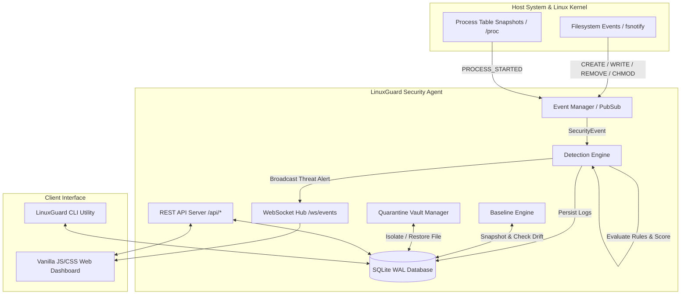

# LinuxGuard — Lightweight Linux Security Monitor

[](https://opensource.org/licenses/Apache-2.0)
[](https://golang.org/)
[](https://www.docker.com/)

> **Important Security Disclaimer**: LinuxGuard is a host-based security monitoring tool, not a replacement for a commercial antivirus, EDR, firewall, or SIEM.

LinuxGuard is a lightweight, modular, host-based security monitoring agent built in pure Go for Ubuntu/Linux servers. It monitors filesystem integrity, tracks running processes, calculates streaming SHA-256 hashes, scores threats using a modular rule engine, isolates suspicious files in a safe quarantine vault, and serves a modern dark-themed Web Dashboard with real-time WebSocket event feeds.

---

## 🏗️ Architecture Overview

LinuxGuard follows a clean, decoupled, event-driven architecture designed to separate observation from threat assessment and human-driven quarantine decisions.



---

## 🔄 Security Threat Lifecycle & Data Flow

LinuxGuard intentionally enforces a strict observation-to-action lifecycle, avoiding destructive auto-deletion to prevent false-positive data loss:

```text
  Observation          Event Generation         Detection & Scoring        Alert & Isolation         Human Decision
┌─────────────┐       ┌─────────────────┐       ┌─────────────────┐       ┌─────────────────┐       ┌──────────────┐
│  fsnotify   │  ──>  │  SecurityEvent  │  ──>  │ DetectionEngine │  ──>  │ WebSocket Broadcast │  ──>  │ Dashboard    │
│  /proc Diff │       │  (Path, PID)    │       │ (Rule Scoring)  │       │ & SQLite Record │       │ Inspect      │
└─────────────┘       └─────────────────┘       └─────────────────┘       └─────────────────┘       │ Restore/Del  │
                                                                                                    └──────────────┘
```

1. **Observation**: `fsnotify` detects file changes; `/proc` snapshots detect new PIDs.
2. **Event Generation**: Raw kernel observations are converted into standardized `SecurityEvent` structs.
3. **Detection & Scoring**: The `DetectionEngine` evaluates events against modular `Rule` interfaces, accumulating risk scores (`0-100`) and assigning severity levels (`LOW`, `MEDIUM`, `HIGH`, `CRITICAL`).
4. **Alert & Persistence**: Events are logged to a WAL-mode SQLite database and pushed in real-time via WebSockets to connected dashboards.
5. **Human Decision**: The administrator inspects threats on the Web Dashboard or CLI and executes controlled Quarantine, Restoration, or Deletion.

---

## 🔍 Core Security Subsystems

### 1. Bounded Filesystem Monitor & Streaming Hashing (`internal/filesystem`)
- **Event-Driven**: Uses `fsnotify` for real-time monitoring of `CREATE`, `WRITE`, `REMOVE`, `RENAME`, and `CHMOD` events.
- **Recursion & Depth Control**: Recursively discovers directory trees while respecting maximum depth limits and explicit path exclusion rules (e.g. ignoring `/proc`, `/sys`, `/dev`).
- **Symlink Protection**: Inspects file modes via `os.Lstat` and **refuses to follow symlinks** to prevent TOCTOU symlink redirection attacks.
- **Streaming SHA-256**: Uses `io.Copy` to stream file contents directly into `crypto/sha256`, preventing memory spikes on large files.

### 2. File Integrity Baseline Engine (`internal/filesystem/baseline.go`)
- **Snapshot Creation** (`linuxguard baseline create`): Scans monitored paths and stores path, size, SHA-256 hash, POSIX permissions, owner, and group in SQLite.
- **Drift Comparison** (`linuxguard baseline check`): Compares active filesystem state against saved baseline to detect:
  - `NEW_FILES`: Unrecognized files added to critical directories.
  - `MODIFIED_FILES`: Files whose SHA-256 or size has changed.
  - `DELETED_FILES`: Missing system baseline files.
  - `PERMISSION_CHANGED`: Mode or permission attribute modifications.

### 3. Process Monitor (`internal/processes`)
- **PID Diffing**: Periodically polls process table snapshots via `/proc` or `gopsutil`.
- **Process Context**: Captures PID, Parent PID (PPID), binary execution path, full command line, running user, CPU %, and memory usage.
- **Event Dispatching**: Emits `PROCESS_STARTED` events whenever a new PID is spawned.

### 4. Modular Detection Engine (`internal/detection`)
Rule interface architecture allows seamless addition of new detection logic:

```go
type Finding struct {
    RuleName string
    Score    int
    Reason   string
}

type Rule interface {
    Name() string
    Evaluate(event SecurityEvent) *Finding
}
```

#### Included Security Rules:
- **`SuspiciousTmpExecutableRule`**: Executable file created or executed inside `/tmp`, `/var/tmp`, or `/dev/shm` (+40 score).
- **`SensitiveFileModificationRule`**: Modifications to `/etc/passwd`, `/etc/shadow`, `/etc/sudoers`, or `/etc/crontab` (+50 score).
- **`HiddenExecutableRule`**: Executable starting with a dot `.` (+35 score).
- **`RootUnusualExecutableRule`**: Root process executed from non-standard user directories (+45 score).
- **`SuspiciousPermissionRule`**: World-writable executables (`0777`) or SUID/SGID permission bits (+30 score).

#### Threat Scoring & Severity Matrix:
- `0 - 29` : **LOW** (Informational activity)
- `30 - 59`: **MEDIUM** (Suspicious file or process modification)
- `60 - 79`: **HIGH** (Multiple threat indicators detected)
- `80 - 100`: **CRITICAL** (High-risk executable in system directory)

### 5. Hardened Quarantine Vault (`internal/quarantine`)
- **Isolation Pipeline**: Validates paths -> Checks for symlinks -> Calculates pre-quarantine SHA-256 -> Relocates to `/var/lib/linuxguard/quarantine/q-xxxxxxxx.quarantine` -> Strips permissions to `0400` (read-only) -> Verifies post-quarantine SHA-256 hash -> Records DB metadata.
- **Verified Restore**: Validates original target -> Checks for path collisions -> Restores file -> Verifies restored SHA-256 matches original hash -> Updates DB status.

---

## 🌐 Web Dashboard & Navigation

Access the Web Dashboard served directly by the embedded Go HTTP server:

👉 **`http://127.0.0.1:9876`**  
👉 **`http://localhost:9876`**

```text
┌────────────────────────────────────────────────────────────────────────────────────────┐
│  LinuxGuard v1.0.0               [Check Baseline]  [Update Baseline]  🟢 Live Feed    │
├───────────────┬────────────────────────────────────────────────────────────────────────┤
│ 📊 Dashboard  │  System Risk       Critical Threats    Monitored Events    Quarantined │
│ 📄 Events     │     [LOW]                 0                  142                1      │
│ ⚠️ Threats     ├────────────────────────────────────────────────────────────────────────┤
│ ⚙️ Processes   │  Recent Security Activity Table                                        │
│ 🔒 Quarantine │  Time       Severity    Type          Path / Details                   │
│ 🖥️ System      │  21:30:05   CRITICAL    THREAT_DETECTED /tmp/.update.sh (+85)            │
└───────────────┴────────────────────────────────────────────────────────────────────────┘
```

---

## 🐳 Container & Docker Deployment Options

LinuxGuard supports containerized deployment while maintaining host-level security monitoring capabilities.

### Option A: Quick Docker Demo Script

Run our automated build and test script:

```bash
./scripts/docker_demo.sh
```

Then visit **`http://127.0.0.1:9876`** in your browser.

### Option B: Docker Compose

```bash
# Start container in host monitoring mode
docker-compose up -d

# View container logs
docker-compose logs -f
```

### Host Monitoring Container Flags:
* `--pid=host`: Gives container visibility into host system PIDs (`/proc`).
* `network_mode: "host"`: Binds API and WebSocket directly to host port `9876`.
* `cap_add: [SYS_PTRACE, DAC_READ_SEARCH]`: Enables process inspection without uninhibited root access.

---

## 📦 Project Structure & File Map

```text
linuxguard/
├── cmd/linuxguard/main.go        # CLI Entry point & subcommand handler
├── internal/
│   ├── agent/agent.go            # Agent Central Orchestrator & Signal Handler
│   ├── config/config.go          # YAML Configuration parser with safe fallbacks
│   ├── database/database.go      # SQLite WAL Connection & Table CRUD operations
│   ├── events/manager.go         # Thread-safe pub/sub Event Manager
│   ├── filesystem/monitor.go     # fsnotify Directory Watcher & Scanner
│   ├── filesystem/baseline.go    # Baseline snapshot & comparison engine
│   ├── processes/monitor.go      # /proc Process snapshot collector & diff engine
│   ├── detection/engine.go       # Modular Security Rule Engine & Scoring
│   ├── quarantine/manager.go     # Hardened Quarantine isolation vault
│   ├── system/system.go          # Host System Diagnostics (CPU, RAM, Uptime)
│   └── api/server.go             # Embedded Web Server (//go:embed web/*) & WS Hub
├── Dockerfile                    # Multi-stage Docker build file
├── docker-compose.yml            # Docker Compose configuration for host monitoring
├── deploy/linuxguard.service     # Hardened systemd service definition
└── scripts/
    ├── install.sh                # Production installation script for Ubuntu
    ├── uninstall.sh              # Uninstallation script
    └── docker_demo.sh            # Automated Docker build & demo script
```

---

## ⚙️ Configuration Reference (`linuxguard.yaml`)

```yaml
server:
  host: "127.0.0.1"    # Loopback binding for security
  port: 9876

database:
  path: "/var/lib/linuxguard/linuxguard.db"

monitoring:
  paths:
    - "/etc"
    - "/usr/local/bin"
    - "/opt"
    - "/var/www"
  excluded_paths:
    - "/proc"
    - "/sys"
    - "/dev"
    - "/run"

process_monitor:
  enabled: true
  interval_seconds: 3

quarantine:
  enabled: true
  path: "/var/lib/linuxguard/quarantine"

detection:
  enabled: true
  suspicious_extensions:
    - ".sh"
    - ".bin"
    - ".elf"
    - ".py"
    - ".pl"
    - ".so"
```

---

## 💻 CLI Usage Reference

```bash
# Start daemon agent
linuxguard

# Show current agent status & config
linuxguard status

# Execute security scan on monitored paths
linuxguard scan

# Create file integrity baseline
linuxguard baseline create

# Compare filesystem state against baseline
linuxguard baseline check

# Display recent security events log
linuxguard events

# List items in quarantine vault
linuxguard quarantine list

# Print version
linuxguard version
```

---

## 🧪 Running Tests

Execute full test suite across all packages with race condition detection:

```bash
go test -v -race ./...
gofmt -s -w .
go vet ./...
```

---

## 📜 License

Licensed under the [Apache License, Version 2.0](LICENSE). Copyright 2026 Eng-Ahmet (LinuxGuard Contributors).
